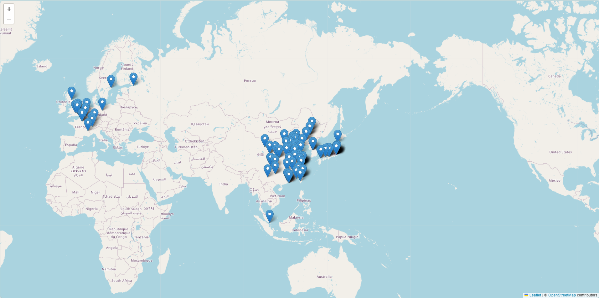

# Leaflet Map Example - README

This is a minimal template for creating a leaflet map in a HTML file with custom data. The map is created using the [Leaflet](https://leafletjs.com/) library, which is a lightweight, mobile-friendly, and easy-to-use JavaScript library for interactive maps.

To use, just download the code using .zip download above, extract the files onto a folder on your local machine, and open the `index.html` file in a browser.
